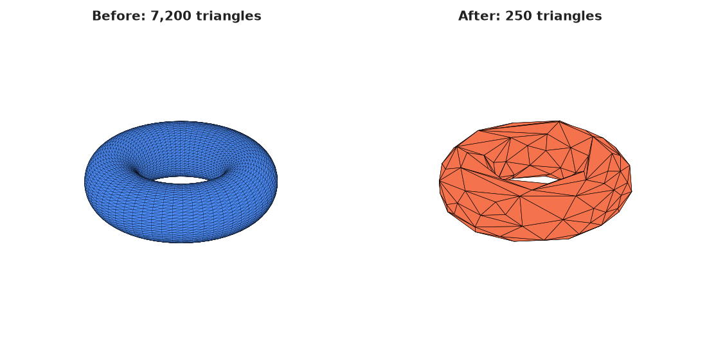

# ros-mesh-preprocessor

**Mesh optimization toolkit for ROS2, MoveIt, and digital twins.**

[](https://github.com/ookkshirsagar/ros-mesh-preprocessor/actions/workflows/ci.yml)
[](LICENSE)
[](pyproject.toml)

> A 200,000-triangle CAD export dropped straight into Gazebo or MoveIt kills real-time planning. This CLI turns raw meshes into clean, decimated, quality-validated visual and collision assets, with a JSON report proving how much was lost.

---

## Quick start

```bash
git clone https://github.com/ookkshirsagar/ros-mesh-preprocessor.git && cd ros-mesh-preprocessor
pip install -e .
ros-mesh-preprocessor --input your_mesh.stl --output your_mesh_small.obj --triangles 5000
```

That's it: no `python -m`, no manual `sys.path` juggling. Three commands, one clean mesh.

---

## Why this exists

Loading a raw CAD export into MoveIt or Gazebo with 200,000 triangles kills real-time planning. This tool solves that problem and goes further:

| Feature | What it does |
|---|---|
| **QEM Decimation** | Reduces triangle count while preserving geometric shape |
| **Visual / Collision pair** | One command → `_visual.stl` + `_collision.stl` + URDF `<geometry>` snippet |
| **MoveIt load check** | Validates the exported URDF snippet and mesh files before you wire them into a planning scene |
| **Batch processing** | Process an entire robot cell folder in one command |
| **Hausdorff validation** | Quantifies shape deviation before you commit to a simplification level |
| **JSON benchmark report** | Records triangle count, file size, processing time, and error metrics |
| **Cross-platform** | Windows and Ubuntu, Python 3.10+ |

### Why not MeshLab / Blender / manual decimation?

MeshLab and Blender are excellent for one-off, by-hand mesh cleanup, but neither is built to sit in a pipeline. This tool exists for the case where you have a batch of meshes to process the same way, repeatedly, without a human clicking through a GUI each time:

- **Scriptable and reproducible.** `ros-mesh-preprocessor --folder ./cell_assets --collision 5000` processes an entire robot cell in one command with the same parameters every time: no GUI settings to forget or misremember between runs.
- **CI-friendly.** It's a normal CLI with exit codes (`0`/`1`/`2`), so it can run in GitHub Actions and fail a build the same way a lint check would. Neither MeshLab nor Blender is designed for that.
- **Quantified output, not eyeballing.** Every run can emit a JSON report with Hausdorff deviation, so "how much did I just distort this mesh?" has a number, not a guess from rotating it on screen.
- **Built for the URDF/MoveIt handoff.** The visual/collision pair + `<geometry>` snippet + load-check pipeline is specific to what a ROS2 robot description actually needs, not a general-purpose modelling workflow.

If you're doing one-off manual cleanup of a single hero asset, MeshLab is still the right tool. If you're doing the same decimation across a folder of parts, or wiring it into CI, this is the one built for that.

---

## Before / after

Real output from `simplify_mesh()`, a 7,200-triangle torus decimated to 250 triangles (reproduce with `python docs/generate_before_after.py`, requires `pip install -e ".[viz]"`):



---

## Installation

```bash
git clone https://github.com/ookkshirsagar/ros-mesh-preprocessor.git
cd ros-mesh-preprocessor

python3 -m venv venv
source venv/bin/activate        # Linux / macOS
venv\Scripts\activate           # Windows PowerShell

pip install -e .                # installs the `ros-mesh-preprocessor` command
```

For development (tests, linting, pre-commit):

```bash
pip install -e ".[dev]"
pre-commit install
```

If you'd rather not install the package, `python -m optimizer.cli` still works and takes the same arguments.

---

## Usage

Run `ros-mesh-preprocessor --help` for the full flag reference, exit-code contract, and inline examples. The highlights:

### Single file

```bash
# Reduce to an absolute triangle count
ros-mesh-preprocessor --input model.stl --output model_small.obj --triangles 5000

# Reduce by percentage (keep 20% of original)
ros-mesh-preprocessor --input env.ply --output env_small.ply --reduction 80

# Save a JSON report alongside the output
ros-mesh-preprocessor --input model.stl --output model_small.stl --triangles 5000 --save-report

# Preview what would happen without writing anything
ros-mesh-preprocessor --input model.stl --output model_small.obj --triangles 5000 --dry-run
```

Real output from the second command above:

```
────────────────────────────────────────────────────
  Mesh Preprocessing Report
────────────────────────────────────────────────────
  Input         : /tmp/test_sphere.stl
  Output        : /tmp/out/small.obj
  Triangles     : 97,280  →  2,000
  Reduction     : 97.94%
  File size     : 4.639 MB  →  0.114 MB
  Time          : 0.7856 s
  Hausdorff max : 0.030926 (mesh units)
  Hausdorff RMS : 0.010032 (mesh units)
────────────────────────────────────────────────────
```

### URDF pair: visual + collision mesh

```bash
ros-mesh-preprocessor \
  --input robot_cell.stl \
  --urdf-output ./output \
  --visual 20000 --collision 3000
```

Produces:
```
output/
├── robot_cell_visual.stl
├── robot_cell_collision.stl
├── robot_cell_urdf_snippet.xml     ← drop-in <geometry> tags
├── robot_cell_visual_report.json
└── robot_cell_collision_report.json
```

The XML snippet is ready to paste into your URDF:

```xml
<link name="robot_cell">
  <visual>
    <geometry>
      <mesh filename="package://YOUR_PACKAGE/meshes/robot_cell_visual.stl" scale="1 1 1"/>
    </geometry>
  </visual>
  <collision>
    <geometry>
      <mesh filename="package://YOUR_PACKAGE/meshes/robot_cell_collision.stl" scale="1 1 1"/>
    </geometry>
  </collision>
</link>
```

### Batch: entire robot cell folder

```bash
ros-mesh-preprocessor \
  --folder ./cell_assets \
  --output ./optimized \
  --collision 5000 --save-report
```

Processes every STL / OBJ / PLY / OFF / GLB in the folder and saves a combined `batch_report.json`.

### Explicit format override

```bash
# Force OBJ output regardless of the output path's extension
ros-mesh-preprocessor --input model.stl --output model_small --triangles 5000 --format obj
```

### Verbose logging

```bash
ros-mesh-preprocessor --folder ./cell_assets --collision 5000 -v
```

---

## Robotics workflow demo

`examples/moveit_cell_demo` runs the full, believable pipeline a robot cell integrator would actually follow:

```
raw mesh → clean → visual/collision decimation → URDF snippet → MoveIt load check
```

```bash
python examples/moveit_cell_demo/run_demo.py
```

It generates a synthetic high-polygon mesh if no `robot_cell.stl` is present, runs the URDF export, and finishes with a **MoveIt load check**, a static validation pass (no ROS2/MoveIt install required) that confirms the generated URDF snippet is well-formed, every referenced mesh file exists and loads, and the collision mesh is within a real-time triangle budget. Real output:

```
────────────────────────────────────────────────────────────
  MoveIt Load Check
────────────────────────────────────────────────────────────
  [PASS] URDF snippet is well-formed XML  (.../robot_cell_urdf_snippet.xml)
  [PASS] Root element is <link>  (name=robot_cell)
  [PASS] <visual> element present
  [PASS] visual mesh file exists on disk  (.../robot_cell_visual.stl)
  [PASS] visual mesh has triangles  (20,000 triangles)
  [PASS] visual mesh has positive surface area  (3.125470)
  [PASS] <collision> element present
  [PASS] collision mesh file exists on disk  (.../robot_cell_collision.stl)
  [PASS] collision mesh has triangles  (3,000 triangles)
  [PASS] collision mesh has positive surface area  (3.125470)
  [PASS] collision mesh is within the 5,000-triangle real-time budget  (3,000 / 5,000)
────────────────────────────────────────────────────────────
  Overall: READY FOR MOVEIT
────────────────────────────────────────────────────────────
```

The script exits `0` when every check passes and `1` otherwise, so it's usable as a CI gate on generated robot assets.

---

## Benchmark report

Every run can emit a structured JSON report:

```json
{
  "input_file": "robot_cell.stl",
  "output_file": "output/robot_cell_collision.stl",
  "original_triangles": 389120,
  "reduced_triangles": 3000,
  "reduction_percent": 99.23,
  "file_size_before_mb": 18.555,
  "file_size_after_mb": 0.143,
  "processing_time_sec": 3.65,
  "hausdorff_max": 0.032679,
  "hausdorff_mean": 0.008853,
  "hausdorff_rms": 0.009990
}
```

**Hausdorff distance** (in mesh units) quantifies the maximum and average geometric deviation between the original and simplified surface, letting you make an informed decision about how aggressively to decimate without a visual inspection.

### Reduction vs. quality trade-off

Real numbers from `benchmarks/generate_report.py`, decimating a 389,120-triangle synthetic mesh to six target sizes (reproduce with `python benchmarks/generate_report.py`; full output in [`benchmarks/performance_results.json`](benchmarks/performance_results.json)):

| Target triangles | Reduction | File size | Time | Hausdorff max | Hausdorff RMS |
|---:|---:|---:|---:|---:|---:|
| 20,000 | 94.86% | 18.6 MB → 0.95 MB | 4.01 s | 0.0319 | 0.0100 |
| 10,000 | 97.43% | 18.6 MB → 0.48 MB | 4.11 s | 0.0302 | 0.0100 |
| 5,000  | 98.72% | 18.6 MB → 0.24 MB | 4.53 s | 0.0314 | 0.0099 |
| 2,000  | 99.49% | 18.6 MB → 0.10 MB | 4.12 s | 0.0313 | 0.0100 |
| 1,000  | 99.74% | 18.6 MB → 0.05 MB | 4.05 s | 0.0284 | 0.0100 |
| 500    | 99.87% | 18.6 MB → 0.02 MB | 4.92 s | 0.0338 | 0.0109 |

Hausdorff deviation stays essentially flat across two orders of magnitude of reduction on this mesh, a sign the QEM decimation is preserving overall shape well even at aggressive reduction levels, though the right target for your own geometry should still be picked using its own Hausdorff numbers, not this table.

---

## Project structure

```
ros-mesh-preprocessor/
│
├── optimizer/
│   ├── __init__.py
│   ├── core.py           # Load, clean, simplify, save
│   ├── metrics.py        # Hausdorff distance + benchmark report
│   ├── urdf_export.py    # Visual/collision pair + URDF snippet
│   ├── moveit_check.py   # Static URDF/mesh validation ("would this load in MoveIt?")
│   └── cli.py            # argparse CLI, packaged as the `ros-mesh-preprocessor` command
│
├── examples/
│   └── moveit_cell_demo/
│       └── run_demo.py   # raw mesh -> clean -> decimate -> URDF -> load check
│
├── benchmarks/
│   ├── generate_report.py       # regenerates performance_results.json
│   └── performance_results.json
│
├── docs/
│   ├── generate_before_after.py # regenerates the before/after image
│   └── img/before_after.png
│
├── tests/
│   ├── test_core.py         # load/save, simplify, malformed-input, regression tests
│   ├── test_urdf_export.py
│   ├── test_moveit_check.py
│   └── test_cli.py          # exit codes, dry-run behaviour
│
├── .github/workflows/ci.yml # lint, test matrix (3.10-3.12), packaging build
├── .pre-commit-config.yaml
├── pyproject.toml           # packaging + console_scripts entry point
├── requirements.txt
├── requirements-dev.txt
├── CHANGELOG.md
├── LICENSE
└── README.md
```

---

## Running tests

```bash
pip install -e ".[dev]"
pytest tests/ -v
```

49 tests covering mesh load/save round-trips across all supported formats, malformed/missing input handling, triangle-count reduction regression bounds, URDF export correctness, MoveIt load-check logic, and CLI exit codes.

---

## Supported formats

| Format | Extension | Read | Write |
|---|---|---|---|
| STL | `.stl` | ✅ | ✅ |
| OBJ | `.obj` | ✅ | ✅ |
| PLY | `.ply` | ✅ | ✅ |
| OFF | `.off` | ✅ | ✅ |
| GLB / GLTF | `.glb` `.gltf` | ✅ | ✅ |

Format conversion is free: specify a different extension on `--output`, or force one explicitly with `--format`.

---

## Roadmap

- [ ] Voxel-based simplification mode (alternative to QEM)
- [ ] ROS2 launch file integration example
- [ ] Planning time benchmark (MoveIt before/after comparison)
- [ ] Dockerfile for containerized CI runs
- [ ] Tagged releases with prebuilt artifacts

---

## Contributing

Pull requests are welcome. For major changes, open an issue first to discuss what you would like to change. See [CONTRIBUTING.md](CONTRIBUTING.md) for the full guide.

```bash
pip install -e ".[dev]"
pre-commit install   # runs black + flake8 on every commit

pytest tests/ -v            # test
black --line-length 99 optimizer/ tests/   # format
flake8 optimizer/ tests/    # lint
```

See [CHANGELOG.md](CHANGELOG.md) for release history.

---

## License

[MIT](LICENSE)

---

## Related tools

- [Open3D](http://www.open3d.org/): the geometry processing engine powering this toolkit
- [MoveIt](https://moveit.ros.org/): motion planning framework for ROS2
- [Meshlab](https://www.meshlab.net/): GUI alternative for manual mesh inspection
